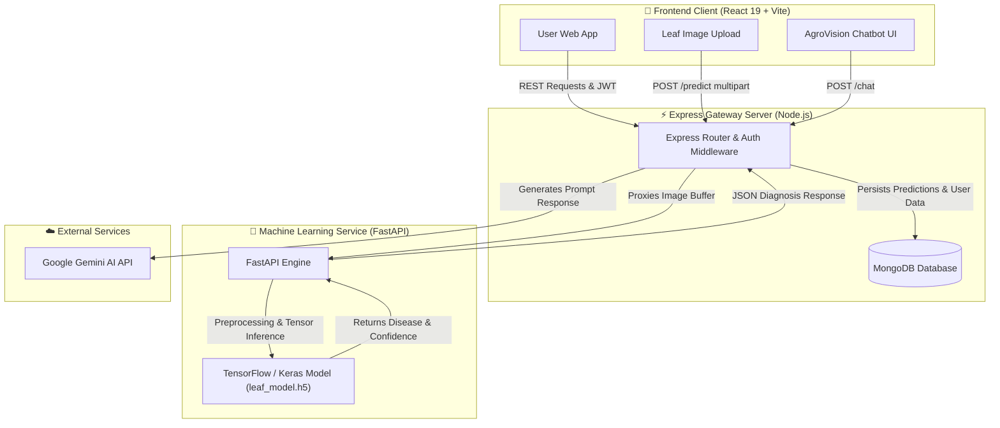

# 🌾 AgroVision AI - Intelligent Crop Health & Disease Diagnostic Platform

[](https://react.dev/)
[](https://vitejs.dev/)
[](https://tailwindcss.com/)
[](https://expressjs.com/)
[](https://www.mongodb.com/)
[](https://fastapi.tiangolo.com/)
[](https://www.tensorflow.org/)

> **AgroVision AI** is an end-to-end, multi-service agricultural intelligence platform engineered to empower farmers, agronomists, and researchers with real-time deep learning plant disease diagnostics, automated crop monitoring, historical analytics, field management, and an interactive Gemini AI agricultural advisor.

---

## 🏗️ System Architecture

AgroVision AI is structured as a decoupled, microservice-inspired architecture consisting of three core sub-systems:



---

## 🌟 Key Features

* **🌿 Computer Vision Leaf Disease Detection**: Upload plant leaf images (Tomato, Potato, Chilli, Corn, Grape, etc.) for instant deep learning disease classification with precision confidence scoring.
* **🤖 Embedded Gemini AI Advisor**: Interactive conversational chatbot (`Chatbot.jsx`) powered by Google's Gemini models for tailored crop care, treatment strategies, and farming guidance.
* **📊 Farm Health Dashboard**: Visual analytics overview displaying total monitored plants, disease outbreak counts, and daily AI diagnostic metrics.
* **🌾 Managed User Crop Fields**: Add, track, and manage personal crop plots (`UserCrop.jsx`) with updated health status indicators.
* **📜 Diagnostic History Logs**: Full audit trail of past leaf scans (`History.jsx`) persisted in MongoDB for long-term health tracking.
* **📚 Disease Reference Library**: Extensive searchable catalog of crop diseases, symptoms, causes, and severity rankings (`Diseases.jsx`).
* **🔔 Real-Time Notifications**: Automated alert generation upon detection of severe plant diseases.
* **🔒 JWT Authentication**: Secure user registration and login workflows with hashed password protection (`bcrypt`).

---

## 📁 Repository Structure

```text
ARGOVISION AI/
├── crop-frontend/          # 🎨 React 19 + Vite Frontend Application
│   ├── public/             # Static public images & graphics
│   ├── src/                # React pages, components, & custom styling
│   ├── package.json        # Frontend dependencies
│   └── README.md           # 📖 Frontend Documentation
│
├── server/                 # ⚡ Express Node.js Backend Server
│   ├── src/                # Controllers, models (User, Prediction, Crop, Notification)
│   ├── uploads/            # Temporary image storage
│   ├── package.json        # Backend dependencies
│   └── README.md           # 📖 Server Documentation
│
├── ml-service/             # 🤖 FastAPI & TensorFlow Machine Learning Microservice
│   ├── app/                # FastAPI main.py & dependencies
│   ├── models/             # Keras deep learning models (.h5) & class labels
│   ├── notebooks/          # Training & test Jupyter notebooks
│   ├── scripts/            # Dataset preprocessing & training scripts
│   └── README.md           # 📖 ML Microservice Documentation
│
└── README.md               # 📖 Root Architecture Overview (This file)
```

---

## 🚀 Sub-System Summaries

| Component | Stack | Primary Responsibilities | Detailed Documentation |
| :--- | :--- | :--- | :--- |
| **`crop-frontend`** | React 19, Vite, Tailwind CSS v4, React Router v7 | Responsive web interface, upload card, theme switcher, dashboard, chatbot UI, scan history | 📖 [Frontend README](file:///d:/CODE/projects/ARGOVISION%20AI/crop-frontend/README.md) |
| **`server`** | Node.js, Express, MongoDB, Mongoose, JWT | API gateway, auth, database persistence, ML service proxying, notification engine, Gemini AI proxy | 📖 [Server README](file:///d:/CODE/projects/ARGOVISION%20AI/server/README.md) |
| **`ml-service`** | Python 3.10+, FastAPI, Uvicorn, TensorFlow | Image preprocessing ($224 \times 224$ RGB normalization), Keras CNN inference, label resolution | 📖 [ML Service README](file:///d:/CODE/projects/ARGOVISION%20AI/ml-service/README.md) |

---

## ⚙️ Local Development & Setup Guide

### 📋 Prerequisites

Ensure you have the following installed on your system:
* **Node.js**: `v18.0.0` or higher
* **Python**: `v3.9` - `v3.11`
* **MongoDB**: Running locally on port `27017` or a cloud MongoDB Atlas URI
* **Git**

---

### 1️⃣ Machine Learning Microservice Setup (`ml-service`)

Open a terminal and set up the Python FastAPI environment:

```bash
cd ml-service

# Create virtual environment
python -m venv venv

# Activate virtual environment
# On Windows (PowerShell):
.\venv\Scripts\Activate.ps1
# On Linux/macOS:
source venv/bin/activate

# Install requirements
pip install -r app/requirements.txt

# Start FastAPI Uvicorn server (Runs on http://localhost:8000)
uvicorn app.main:app --reload --host 0.0.0.0 --port 8000
```

---

### 2️⃣ Express Backend Server Setup (`server`)

Open a second terminal to initialize and launch the Express backend:

```bash
cd server

# Install Node dependencies
npm install

# Configure Environment Variables (.env)
# Create a .env file if not present:
```

```env
PORT=3000
MONGO_URI=mongodb://127.0.0.1:27017/agrovision
JWT_SECRET=mySuperSecretKey123
JWT_EXPIRES=7d
GEMINI_API_KEY=your_gemini_api_key_here
ML_SERVICE_URL=http://localhost:8000/predict
```

```bash
# Start backend in development mode (Runs on http://localhost:3000)
npm run start:dev
```

---

### 3️⃣ Frontend Client Setup (`crop-frontend`)

Open a third terminal to run the Vite React frontend:

```bash
cd crop-frontend

# Install dependencies
npm install

# Start Vite dev server (Runs on http://localhost:5173)
npm run dev
```

Open your browser and navigate to **`http://localhost:5173`** to access **AgroVision AI**.

---

## 🌐 Environment Variables Reference

### Backend Server (`server/.env`)

| Variable | Description | Default Value |
| :--- | :--- | :--- |
| `PORT` | Express server port | `3000` |
| `MONGO_URI` | MongoDB connection string | `mongodb://127.0.0.1:27017/agrovision` |
| `JWT_SECRET` | Secret key for signing authentication tokens | `mySuperSecretKey123` |
| `JWT_EXPIRES` | Token expiration duration | `7d` |
| `GEMINI_API_KEY` | Google Gemini API Key for chatbot responses | `AIzaSy...` |
| `ML_SERVICE_URL` | Fast API endpoint for ML inference | `http://localhost:8000/predict` |

---

## 📄 License

This repository is maintained under the **AgroVision AI** project suite.
